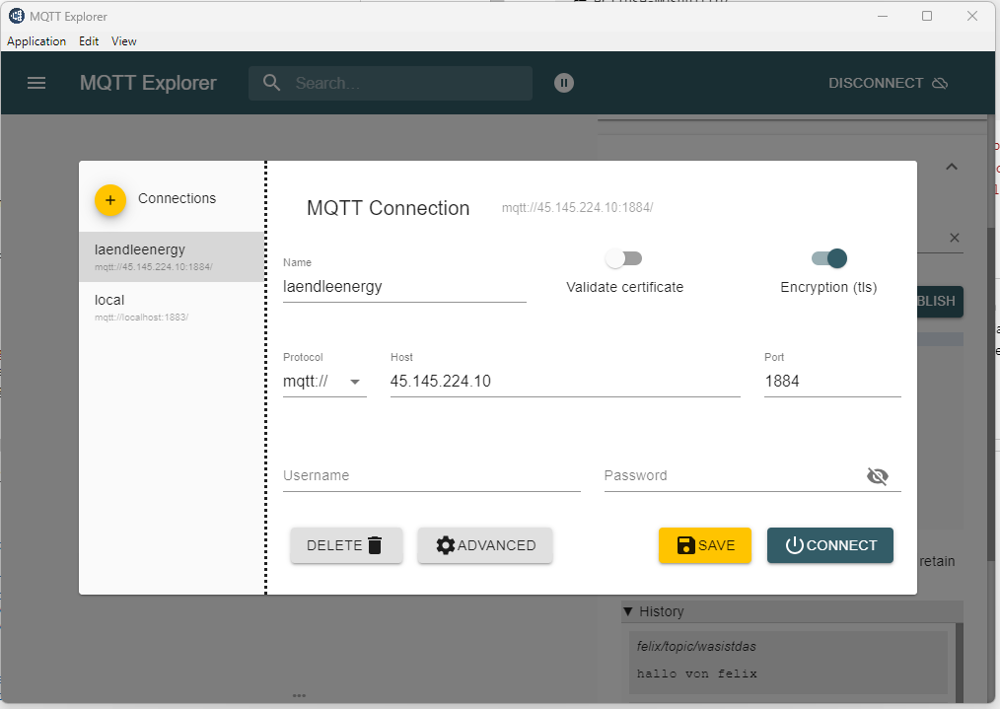
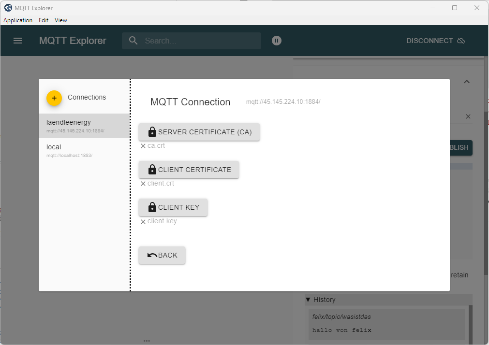

# MQTT Broker

dieses Projekt stellt einen MQTT Broker für LaendleEnergy bereit.

Der Broker ist deployed auf `45.145.224.10:1884` und akzeptiert Verbindungen
von Clients, die das richtige Zertifikat verwenden. diese sind abgelegt unter
`eclipse-mosquitto/certs`.





## Projektsetup

```
project-root/
├─ eclipse-mosquitto/
│  ├─ Dockerfile
├─ component_2/
│  ├─ Dockerfile
│  ├─ config
azure-pipeline.yaml
```

Notwendige Komponenten werden in Ordnern, gemeinsam mit einem `Dockerfile`
und ev. notwendigen Configfiles abgelegt. Dieses Projekt besteht nur aus einer
Komponente `eclipse-mosquitto`. Die Azure Pipeline baut für jede Komponente
ein Dockerimage und pusht es auf `ghcr.io/laendleenergy/<component_name>:<tag>`.

## Deployment produktiv

Jeder Push auf `master` testet, ob das Bauen der einzelnen Komponenten möglich
ist. Soll das Image auch auch `ghcr.io/LaendleEnergy/<component_name>` gepusht
werden, muss das bei einem manuellen Pipelinestart angegeben werden. Dabei
werden Images mit `latest` getagged, außer, es wird manuell ein anderer Tag
als Parameter angegeben.

## Dev Lokal

Lokal kann das Projekt über das Deploymentprojekt gestartet werden. Dafür ist
es notwendig, dass dieses Projekt und das Deploymentprojekt im selben
Verzeichnis abgelegt sind:

```
mqtt-broker/
├─ eclipse-mosquitto/
│  ├─ Dockerfile
mqtt-broker.deplyoment
├─ docker-compose.yaml
```

Im Deploymentprojekt ist ein Composefile abgelegt, das in zwei Versionen in
jeweils einem Branch vorhanden sind. Für das produktive Deployment wird
`master`, verwendet, für das lokale Development der Branch `local`. Sind beide
Projekte, wie oben gezeigt, im selben Verzeichnis abgelegt, kann das
Composefile aus `local` das Dockerfile aus diesem Projekt verwenden, um das
Projekt im aktuellen Entwicklungsstand zu bauen und zu starten:

```
cd ..
git pull https://WattWise@dev.azure.com/WattWise/mqtt-broker/_git/mqtt-broker.deployment
git checkout local
docker compose up
```